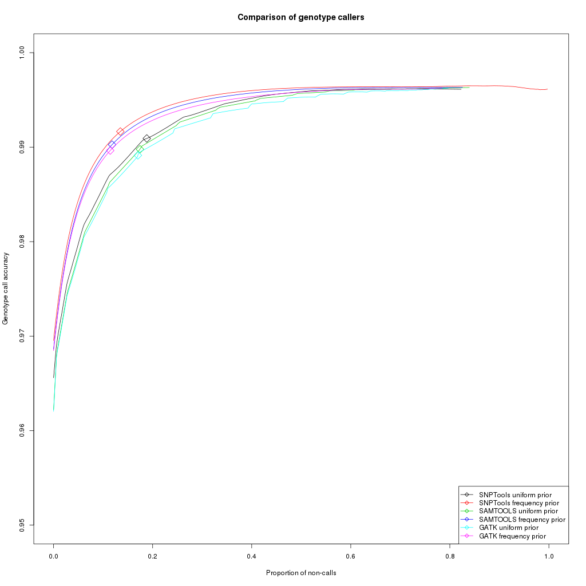

```{r setup, include=FALSE}
knitr::opts_chunk$set(echo = TRUE)
```

# Abstract

# Introduction

Next-generation sequencing (NGS) is an inherently error prone process, yielding data which suffer from a varaiaty of potential errors, among them incorrect or low confidence base-calling as well as errors occuring during de novo assembly or alignment to a reference genome. Since the downstream analysis of virtually all genetic and genomic studies rely heavily on genetic variant detection and the underlying genotype likelihoods, selecting a statistical model of the data that best represents the true nature of the genetic substrate is crucial to correct interpretation of results.

In particular, low-coverage data (<5X per site) on which many NGS studies rely is highly suceptible to uncertainty in variant and genotype calling. This is due to the high probability that only one of two chromosomes is sampled in diploid individuals, making it particularly difficult to detect rare mutations.

The SNPTools pipeline seeks to address some of the analytical challenges in low-coverage genome sequencing data by (1) modelling the weight of each base read using both mapping and base-quality; to be used in both variant calling and genotype likelihood estimation, (2) aggregating reads from all samples to identify alternative alleles (3) calling variant sites by assessing the distribution of alternative alleles across samples to minimize the influence of sequencing errors (4) calling variant sites by assessing the best genotype fit, (5) utilizing millions of putative SNP sites within each BAM to better estimate genotype class binomial probabilites from which to calculate genotype likelihoods.

In this work we seek to compare the SNPTools genotype likelihood model to that of SAMTOOLS and GATK under low-depth sequencing data conditions. Because the true genotype likelihoods are unknown to us, we judge the accuracy of genotype likelihoods by examining their performance on real data through calling genotypes and comparing to true genotypes as specified in the HapMap. We also calculate the site frequency spectrum (SFS) of all variable sites detected by SNPTools according to each of the three genotype likelihood models.

# Materials and Methods

## Github

All scripts employed in data analysis for the purposes of this report can be found at https://github.com/mbenezra/angsd_snptools

## 1000 Genomes Project Data Set (CEU population)

The SNPTools pipeline was applied to 90 individuals from the 1000 genomes project's CEU population.

## HapMap

The HapMap provides true genotype data for selected sites (n=?) of the 90 CEU individuals.

## Analysis of next generation Sequencing Data (ANGSD)

We employ the ANGSD program for genotype likelihood calculations of GATK and SAMTOOLS as well as genotype calling of GATK, SAMTOOLS and SNPTools.

### GATK Genotype Likelihood Model

GATK employs a simple Bayesian genotyper that calculates the posterior probability of each of the possible 10 diploid genotypes from next generation DNA sequencing reads. GATK encorporates the bases covering each locus and their respective phred quality scores.

GATK calculates the prior probability of each of the possible 10 diploid genotypes $G$ given the data $D$ using Bayes' rule.

$$p(G|D)=\frac{p(G)p(D|G)}{p(D)}$$

$p(D)$ is constant across all genotypes and can be ignored. $p(G)$ is the prior probability of observing a genotype and can be set to a uniform prior or an allele frequency prior.

$p(D|G)$ is the product of the probabilities of each base given the genotype.

$$p(D|G)=\prod_{b\in{pileup}}p(b|G)$$

$$p(b|G)=p(b|\{A_1,A_2\})=\frac{1}{2}p(b|A_1)+\frac{1}{2}p(b|A_2)$$

$$p(b|A)=\left\{\begin{matrix}\frac{e}{3}:b\ne{A}\\1-e:b=A\end{matrix}\right.$$

### SAMTOOLS

SAMTOOLS employs a genotype likelihood model that encorporates quality score and quality dependency.

## SNPTools

### Effective Base Depth (EBD) calculation

SNPTools calculates a read depth pseudocount termed Effective Base Depth (EBD) that weights reads based on their read quality and mapping quality. This allows SNPTools to assign a lower weight to base reads with high sequencing and mapping errors that may lead to incorrect identification of alternative alleles. This is particularly problematic where read depth is low.

An EBD value is calculated for each nucleotide of every locus in a sample.

$$EBD_{s,g=A,C,G,T}=\sum_{k}^{K_s}(1-BaseQuality_k)\times (1-MappingQuality_k), for all k=g.$$

### SNP Site Discovery (variance ratio statistic)

SNPTools employs a variance ratio statistic that pulls together EBD pseudocount informtion from all samples in the population and asseses the distribution of alternative allele red counts across the population to call variant sites. Subsequently, SNPTools employs all variant sites in modelling sequencing error in base calling when calculating genotype likelihoods. Specific details of the VarianceRatioStatistic are beyond the scope of this report and the mathematical definitions of the test statistic are provided here for reference.

$$VarianceRatioStatistic=\frac{\sum_{i=1}^{I}[a_{i}-e(a_{i}+r_{i})]^{2}-Te(1-e)}{\sum_{i=1}^{I}Min\left \{ [a_{i}-0(a_{i}+r_{i})]^{2},[a_{i}-\frac{1}{2}(a_{i}+r_{i})]^{2},[a_{i}-1(a_{i}+r_{i})]^{2} \right \}}$$

$$a_{i}=EBD_{i,g=alternative allele}$$

$$r_{i}=EBD_{i,g=reference allele}$$

$$T=\sum_{i}^{I}(a_{i}+r_{i})$$

$$e=\frac{\sum_{i}^{I}(a_{i})}{\sum_{i}^{I}(a_{i}+r_{i})}$$

### Genotype Likelihood estimation (BAM-specific Binomial Mixture Modelling BBMM)

Genotype data likelihoods can be modelled as a binomial distribution and calculated using the binomial mass function as a series of trials represented by the effective base depth (EBD) counts $r_s + a_s$ for each site with the success binomial probability $p_v$ of a reference read defined for each of the genotype classes rr=Ref/Ref, ra=Ref/Alt and aa=Alt/Alt where $v$ is the genotype class. If sequencing was error free, the binomial probabilities of a reference read for each of the genotype classes would be $p_{rr}=1$, $p_{ra}=0.5$ and $p_{aa}=0$.

$$Binomial(r_{s}+a_{s},p_{v})=\begin{bmatrix}r_{s}+a_{s}\\ a_{s}\end{bmatrix}p_{v}^{a_{s}}(1-p_{v})^{r_{s}}$$
In reality the binomial probabilities of a reference read at each of the genotype classes deviate from the theoretical values. Moreover, general operational heterogeneity in a collection of samples (ex: sequencing runs, sequencing centers, etc) contribute to variability that decreases the signal to noise ratio. For this reason SNPTools estimates BAM-specific values of the binomial probabilities. In turn these BAM-specific probabilities are used for calculating the genotype data likelihoods as described above.

In order to estimate the binomial probabilities $p_v$, SNPTools models each BAM as a flexible binomial mixture. The binomial mixture is a linear superposition of three binomials each representing one of the genotype classes (rr, ra, aa). Each of the three binomials accounts for a certain proportion of the mixture and is assigned a weight $w_v$, put together the weights add up to 1. 

In order to approximate the binomial probabilities $p_v$, SNPTools employs the Expectation Maximization algorithm. Each site is assigned to a genotype class by way of a latent variable $z_{s,v}$, a site can only be assigned to a single genotype class at a time. 

The EM algorithm seeks to maximize the log likelihood function with respect to the parameters $p_v$ and $w_v$.

$$ln(p(r_s,a_s,z_{s,v}|p_v,w_v))$$

Initial values are selected for the paramters $p_v$ and $w_v$ after which the conditional probability of the latent variables given the data and the initial paramters is calculated (E-step). The EM algorithm then calculates new values for the unknown parameters based on the conditional probability of the latent variables (M-step). Once the algorithm converges, the best estimate for the paramters $p_v$ is obtained and genotype likelihoods are calculted as a binomial probability of the data given the binomial probabilities of a reference read at each of the genotype classes.

$$GL_{s,v=rr,ra,aa}=p(a_{s}|z_{s,v},p_{v})=Binomial(r_{s}+a_{s},p_{v})$$

# Results

## Depth

To confirm that we are experimenting on low-dept data, we used the samtools depth command to output the depth of all sites in each of the 90 CEU population BAM files and plotted the distribution of depths in Figure 1. The total depth of the collection of CEU samples is also plotted in red. We observe a mean population sequencing depth of approximately 6-7X. Some of the samples exhibit a higher mean sequencing depth of up to approximately 15X while others are as low as approximately 3X.


## Comparison of genotype call accuracy and validation of genotype calls

To asses the quality of the genotype likelihoods estimted by SNPTools we called genotypes using each of the genotype likelihood models (SNPTools, SAMTOOLS and GATK) using both a uniform and an allele frequency prior. We plotted the proportion of non-calls vs call accuracy (Figure 2) for every quality threshold and highlighted the 0.95 quality threshold in the plot (see diamond markers on lines.)

We called genotypes for the variable sites previously identified by SNPTools for which we also have data in the HapMap (n=1222022). We instructed ANGSD to select the major and minor alleles from GL using maximum likelihood.

The comparison paints a clear picture of better performence under an allele frequency prior in general. We also observe that SNPTools genotype likelihoods yield the most accurate genotype calls. At the 0.95 quality threshold SNPTools performs better than both SAMTOOLS and GATK though at the cost of a higher proportion of non-calls.

In Table 1 we summarise the number of correct and incorrect calls at the 0.95 quality threshold for the various callers. We observe that under the allele frequency prior SNPTools makes more correct calls when compared to the uniform prior, at the same time SNPTools also makes fewer incorrect calls.

[why is the uniform prior showing that pattern?]

[why does a uniform prior perform worse than allele frequency prior?]



```{r, echo=FALSE, results='asis'}

# [1] "snptools.uni.roc"
# [1]  88479071 106198244    810663   3783736
# [1] "snptools.freq.roc"
# [1]  94369752 106631032    794119   3350948
# [1] "sam.uni.roc"
# [1]  89870918 105825320    928526   4156660
# [1] "sam.freq.roc"
# [1]  96052705 106531446    944089   3450534
# [1] "gatk.uni.roc"
# [1]  90271881 105806405    991874   4175575
# [1] "gatk.freq.roc"
# [1]  96400511 106513147   1008880   3468833
df <- data.frame(rbind(c("88479071","810663"),
                       c("94369752","794119"),
                       c("89870918","928526"),
                       c("96052705","944089"),
                       c("90271881","991874"),
                       c("96400511","1008880")))
names(df) <- c("Correct Calls", "Incorrect Calls")
row.names(df) <- c("SNPTools (uniform prior)", "SNPTools (frequency prior)",
                   "SAMTOOLS (uniform prior)", "SAMTOOLS (frequency prior)",
                   "GATK (uniform prior)", "GATK (frequency prior)")
library(knitr)
kable(df, caption = "Genotype call totals at 0.95 genotype likelihood confidence level")

```


## Site Frequency Spectrum (SFS)

We calculate a folded Site Frequency Specturm (SFS) for the variable sites identified by SNPTools (n=12212852), this limitation is due to the fact that SNPTools calculates genotype likelihoods for variable sites alone. We fixed the major and the minor alleles to those calculated by SNPTools [why?]. The normalized spectra for polymorphic sites are shown in Figure 3.

The three genotype likelihood models yield very similar site frequency spectra as well as very similar variablity (calculated as proportion of heterozygous sites.) We observe that the three spectra indicate the existance of approximately 40% non-variable sites of the total 12212852 identified as variable by SNPTools.

[explain why we had to fold the SFS]

[explain the doSaf=5]

[explain the doMajorMinor=3]


# Discussion


The overall similarity between the spectra suggest that SNPTools' genotype likelihood model yields likelihoods which are not overly relaxed or conservative.

# Acknowledgements

Thorfinn Sand Korneliussen

# References

1.	Korneliussen TS, Albrechtsen A, Nielsen R. ANGSD: Analysis of Next Generation Sequencing Data. BMC Bioinformatics. 2014;15:356.

2.	Nielsen R, Paul JS, Albrechtsen A, Song YS. Genotype and SNP calling from next-generation sequencing data. Nat Rev Genet. 2011;12(6):443-51.

3.	Wang Y, Lu J, Yu J, Gibbs RA, Yu F. An integrative variant analysis pipeline for accurate genotype/haplotype inference in population NGS data. Genome Res. 2013;23(5):833-42.

4. http://www.internationalgenome.org/

5. Pattern Recognition and Machine Learning Information Science and Statistics, ISSN 1613-9011 Author	Christopher M. Bishop

6. 

# Figures

