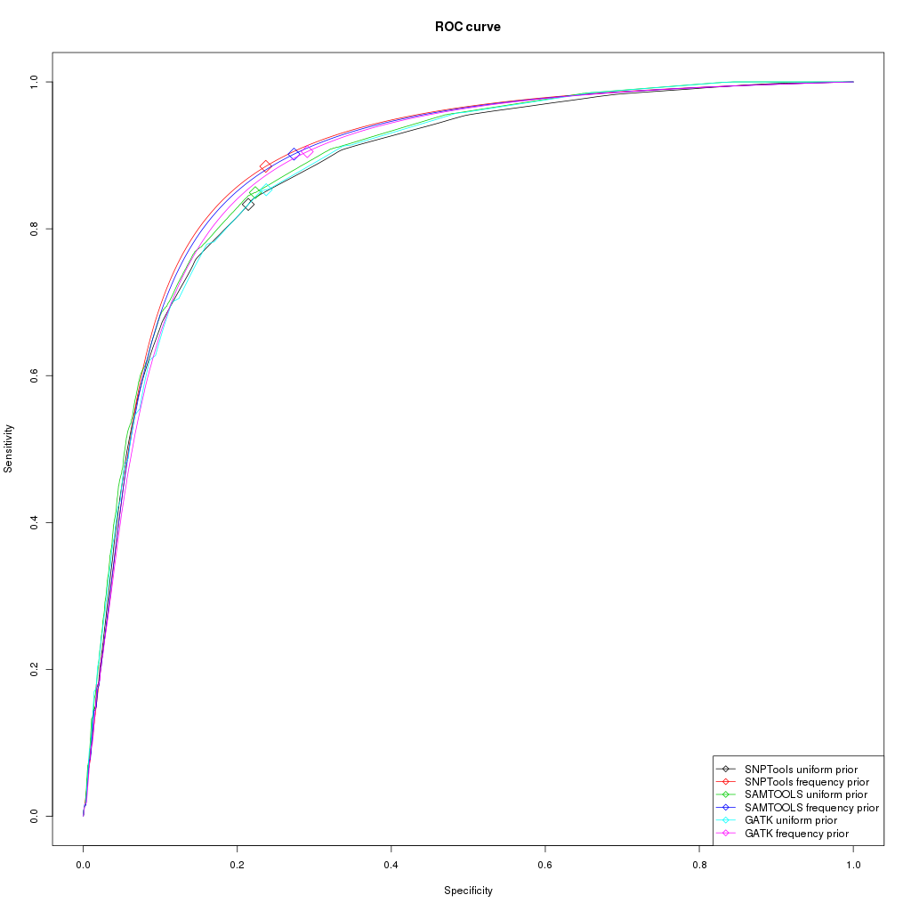

```{r setup, include=FALSE}
knitr::opts_chunk$set(echo = TRUE)
```

# Abstract

# Introduction

Next-generation sequencing (NGS) is an inherently error prone process, yielding data which suffer from a varaiaty of potential errors, among them incorrect or low-confidence base-calling as well as errors occuring during de novo assembly or alignment to a reference genome. Since the downstream analysis of virtually all genetic and genomic studies rely heavily on genetic variant detection and the underlying genotype likelihoods, selecting a statistical model of the data that best represents the true nature of the genetic substrate is crucial to correct interpretation of results.

In particular, low-coverage data (<5X per site) on which many NGS studies rely is highly suceptible to uncertainty in variant and genotype calling. This is due to the high probability that only one of two chromosomes is sampled in diploid individuals, making it particularly difficult to detect rare mutations.

The SNPTools pipeline seeks to address some of the analytical challenges in low-coverage genome sequencing data by (1) modelling the weight of each base read using both mapping and base-quality to be used in both variant calling and genotype likelihood estimation, (2) aggregating reads from all samples to identify alternative alleles (3) calling variant sites by assessing the distribution of alternative alleles across samples to minimize the influence of sequencing errors (4) calling variant sites by assessing the best genotype fit, (5) utilizing millions of putative SNP sites within each BAM to better estimate genotype class binomial probabilites from which to calculate genotype likelihoods.

In this work, we compare the SNPTools genotype likelihood model to that of SAMTOOLS and GATK 

# Materials and Methods

## Github

https://github.com/mbenezra/angsd_snptools

## 1000 Genomes Project Data Set (CEU population)

The SNPTools pipeline was applied to 90 individuals from the 1000 genomes project's CEU population.

## HAPMAP

## Analysis of next generation Sequencing Data (ANGSD)

### GATK Genotype Likelihood Model

GATK employs a simple Bayesian genotyper that calculates the posterior probability of each of the possible 10 diploid genotypes from next generation DNA sequencing reads. GATK encorporates the bases covering each locus and their respective phred quality scores.

GATK calculates the prior probability of each of the possible 10 diploid genotypes $G$ given the data $D$ using Bayes' rule.

$$p(G|D)=\frac{p(G)p(D|G)}{p(D)}$$

$p(D)$ is constant across all genotypes and can be ignored. $p(G)$ is the prior probability of observing a genotype and can be set to a uniform prior or an allele frequency prior.

$$p(D|G)=\prod_{b\in{pileup}}p(b|G)$$

$$p(b|G)=p(b|\{A_1,A_2\})=\frac{1}{2}p(b|A_1)+\frac{1}{2}p(b|A_2)$$

$$p(b|A)=\left\{\begin{matrix}\frac{e}{3}:b\ne{A}\\1-e:b=A\end{matrix}\right.$$

### SAMTOOLS

Quality score and quality dependency based GLs.

## SNPTools

### Effective Base Depth (EBD) calculation

SNPTools calculates a read depth pseudocount termed Effective Base Depth (EBD) that weights reads based on their read quality and mapping quality. This allows SNPTools to assign a lower weight to base reads with high sequencing errors that may lead to incorrect identification of alternative alles. This is particularly problematic where read depth is low.

An EBD value is calculated for each nucleotide of every locus in a sample.

$$EBD_{s,g=A,C,G,T}=\sum_{k}^{K_s}(1-BaseQuality_k)\times (1-MappingQuality_k), for all k=g.$$

### SNP Site Discovery (variance ratio statistic)


$$VarianceRatioStatistic=\frac{\sum_{i=1}^{I}[a_{i}-e(a_{i}+r_{i})]^{2}-Te(1-e)}{\sum_{i=1}^{I}Min\left \{ [a_{i}-0(a_{i}+r_{i})]^{2},[a_{i}-\frac{1}{2}(a_{i}+r_{i})]^{2},[a_{i}-1(a_{i}+r_{i})]^{2} \right \}}$$

$$a_{i}=EBD_{i,g=alternative allele}$$

$$r_{i}=EBD_{i,g=reference allele}$$

$$T=\sum_{i}^{I}(a_{i}+r_{i})$$

$$e=\frac{\sum_{i}^{I}(a_{i})}{\sum_{i}^{I}(a_{i}+r_{i})}$$

### GL estimation (BAM-specific Binomial Mixture Modelling BBMM)

Genotype likelihoods can be modelled as a binomial distribution and calculated using the binomial mass function as a series of trials represented by the effective base depth (EBD) counts $r_s + a_s$ with the success binomial probability $p_v$ of a reference read for each of the genotype classes rr=Ref/Ref, ra=Ref/Alt and aa=Alt/Alt. If sequencing was error free, the binomial probabilities of a reference read for each of the genotype classes would be 1, 0.5 and 0 respectively.

$$Binomial(r_{s}+a_{s},p_{v})=\begin{bmatrix}r_{s}+a_{s}\\ a_{s}\end{bmatrix}p_{v}^{a_{s}}(1-p_{v})^{r_{s}}$$
In reality the binomial probabilities of a reference read at each of the genotype classes deviate from the theoretical values. Moreover, general operational heterogeneity in collection of samples (ex: sequencing runs, sequencing centers, etc) contribute to variability that decreases the signal to noise ratio. For this reason SNPTools estimates BAM specific values of the binomial probabilities. In turn these BAM specific probabilities are used for calculating the GLs.

SNPTools uses the Expectation Maximization algorithm to 

$$GL_{s,v=rr,ra,aa}=p(a_{s}|z_{s,v},p_{v})=Binomial(r_{s}+a_{s},p_{v})$$

# Results

## Depth


## Receiver operating characteristic (ROC)


Using ANGSD we call genotypes for variable sites identified by SNPTools for which we also have data in the hapmap. We infer the major and minor alleles from GL



## Site Frequency Spectrum (SFS)

We calculate a folded SFS for the variable sites identified by SNPTools. We Force the major and the minor alleles to those calculated by SNPTools.


# Discussion

# References

1.	Korneliussen TS, Albrechtsen A, Nielsen R. ANGSD: Analysis of Next Generation Sequencing Data. BMC Bioinformatics. 2014;15:356.

2.	Nielsen R, Paul JS, Albrechtsen A, Song YS. Genotype and SNP calling from next-generation sequencing data. Nat Rev Genet. 2011;12(6):443-51.

3.	Wang Y, Lu J, Yu J, Gibbs RA, Yu F. An integrative variant analysis pipeline for accurate genotype/haplotype inference in population NGS data. Genome Res. 2013;23(5):833-42.

4. http://www.internationalgenome.org/